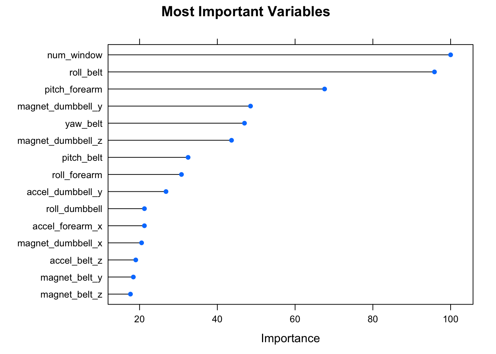

# Final Assignment -  Practical Machine Learning
Luis Matute  
August 25, 2016  

### Objective: 

The objective of this paper is to model and predict the manner in which 6 people used their wearable devices to measure how well they performed barbell lifts. 

The subjects used devices to track movement on their belt, forearm, arm, and dumbell. They were asked to perform barbell lifts correctly and incorrectly in 5 different ways. The goal is to predict the manner in which they did the exercises. 

Two datasets are provided. A large one by the name of training and a much smaller one by the name of testing. The latter will be used for a quiz at the end of this exercise and will not be used during model creation.

### Outline to achieve stated goal:

We will follow this process to get to the model and predictions:

1. Load required libraries and data
2. Explore the data and pre-process where necessary
+ subset for nonrequired information( id's etc )
+ adjust for NA's and or sparse data
+ check for skewness transform if necessary
+ Check for correlation among covariates
3. Based on the number of predictors(p) and size of the dataset (n) make an initial decision on which method to use
4. Split the data into training and test partitions
5. Create a model using the training partition. 
6. Review results and make adjustments if necessary
7. Use the model on the test partition to get an unbiased error estimate
8. Apply the model to the second data set to get predictions for the quiz

### 1-Loading

We start by loading caret and e1071 which we will used for data partitioning, model creation and prediction and stats.


```r
library(caret)
```

```
## Loading required package: lattice
```

```
## Loading required package: ggplot2
```

```r
library(e1071)
```

Next we  load the data:


```r
origtraining<-read.csv('https://d396qusza40orc.cloudfront.net/predmachlearn/pml-training.csv')
origtesting<-read.csv('https://d396qusza40orc.cloudfront.net/predmachlearn/pml-testing.csv')
```

### 2-Data Exploration and pre-processing

The loaded data has the following dimensions:


```r
dimensions<-c(dim(origtraining),dim(origtesting))
names(dimensions)<-c("Training_n","Vars","Testing_n","Vars")
dimensions
```

```
## Training_n       Vars  Testing_n       Vars 
##      19622        160         20        160
```


```r
head(names(origtraining))
```

```
## [1] "X"                    "user_name"            "raw_timestamp_part_1"
## [4] "raw_timestamp_part_2" "cvtd_timestamp"       "new_window"
```

```r
tail(names(origtraining))
```

```
## [1] "accel_forearm_y"  "accel_forearm_z"  "magnet_forearm_x"
## [4] "magnet_forearm_y" "magnet_forearm_z" "classe"
```

It seems that the first few columns of the training set has a number identifiers that will not contribute to the model. So we plan to delete the first 6 of them from both datasets. Specifically these are X, user_name, raw_timestamp_part_1, raw_timestamp_part_2, cvtd_timestamp, new_window. We create the training and testing sets with these first six columns deleted. 


```r
training<-origtraining[,-(1:6)]
testing<-origtesting[,-(1:6)]
```

Next we focus on na's and sparse data.  We want to avoid columns that do not have data (only na's) or have a very low percentage of values. To explore this we create two auxiliary functions *pctna* and *pctsparse* that calculate the ratio of na's and the ratio of blanks in a column. We then apply these functions to review cases where the pct of hits is below 95 % - These columns we keep and the rest we discard for the model.


```r
# na and sparse data detector function
pctna<-function(mylist){sum(is.na(mylist) )/length(mylist)}
pctsparse<-function(mylist){sum(mylist=='' )/length(mylist)}
# simplify sets by deleting na columns and sparse data
keep<-apply(training,2,pctna)<.95
training<-training[,keep]
keep<-apply(testing,2,pctna)<.95
testing<-testing[,keep]

keep<-apply(training,2,pctsparse)<.95
training<-training[,keep]
keep<-apply(testing,2,pctsparse)<.95
testing<-testing[,keep]
```

Next we explore if the data has a skewness problems. 


```r
test<-training[,2:(length(training)-1)]
res<-apply(test,2,skewness)
skewres<-res[(res > 2) | (res < -2)]
skewres
```

```
##    magnet_belt_y gyros_dumbbell_x gyros_dumbbell_y gyros_dumbbell_z 
##        -2.235841      -126.321221        31.648274       135.953437 
##  gyros_forearm_y  gyros_forearm_z 
##        51.323792       116.076194
```

We see that there are 6 covariates where we have skweness problems.  We will leave these for now, as they represent a small percentage of the available covariates. We will return to these if needed, once we know more about the resulting model.

In addition,we will postpone our check on correlation for once we have a better sense of the most important predictors.  

### 3-Model Selection

At this point we have 53. We need a method to handle the relatively large number of covariates and their possibly complex intercations, possibly providing ways of reducing them based on relevance. The random forest method can easily cope with these requisites so we will select this method as a start.

In an initial attempt to directly run the the random forest method on the training set, it took too much processing time. So our plan will be as follows. First we will run a limited version of random forest to explore the relative importance of covariates and with this information trim down the number of covariates we want to use to generate the final model. This will solve processing speed time and hopefully still hit acceptance benchmarks.

### 4- Splitting the training data 

We will split the training set into a trainactive (70%) and a testactive (30%) partition, and use the latter to test our model and obtain unbiased estimates. 
In addition, we will carve out 10 % of trainactive (named smalltest) to create a mini set to be used to determine variable importance. Using the mini set will reduce processing time and provide guidance as to which covariates to use. This mini set will be disregarded after use (will not be used in the final model creation), by complementing trainactive and smalltest into a new training set named trainfinal.


```r
set.seed(12512)
inTrain<-createDataPartition(y=training$classe,p=.7,list=F)
trainactive<-training[inTrain,]
testactive<-training[-inTrain,]
# crate a small partition to run a faster random forest to identify key variables
smallpartition<-createDataPartition(y=trainactive$classe,p=0.1,list=F)
smalltest<-trainactive[smallpartition,]

trainfinal<-trainactive[-smallpartition,]
```

### 5-Model Creation

As stated above,my initial attempt to run *train(classe~.,data=trainmain,method='rf')* was taking  a long time so I decided to abort it. I did not know how long it would take ....so I decided to try another strategy.

50+ covariates are too much we would like to reduce them to 10 to 15. How to select them goes back to relative variable importance. To  get to the most important variables I can either use a small subsample of the trainactive data set, or I could cut the number of trees being used in the random forest algorithm. I opted for the first path.

So here we create the mini-model to determine variable importance


```r
minimodel<-train(classe~.,data=smalltest,method='rf')
```

```
## Loading required package: randomForest
```

```
## randomForest 4.6-12
```

```
## Type rfNews() to see new features/changes/bug fixes.
```

```
## 
## Attaching package: 'randomForest'
```

```
## The following object is masked from 'package:ggplot2':
## 
##     margin
```

```r
importantvars<-varImp(minimodel)
plot(importantvars,main='Most Important Variables ',top=15)
```

<!-- -->

```r
mostimp<-rownames(importantvars[[1]])[order(importantvars[[1]],decreasing=T)[1:10]]
```

We now circle back to review the correlation among the  top 10 covariates shown in the graph.
( 10 is an initial guess for the number of covariates needed)


```r
correl=cor(trainfinal[,mostimp])
diag(correl)<-0
which(abs(correl)>0.75,arr.ind=TRUE)
```

```
##           row col
## yaw_belt    5   2
## roll_belt   2   5
```

Based on the above table we eliminate one of these highly correlated variables and end with our proposed set of predictors.


```r
finalvars<-mostimp[-5]
finalvars
```

```
## [1] "num_window"        "roll_belt"         "pitch_forearm"    
## [4] "magnet_dumbbell_y" "magnet_dumbbell_z" "pitch_belt"       
## [7] "roll_forearm"      "accel_dumbbell_y"  "roll_dumbbell"
```

Now we create the model. Note that we will reduce the number of folds to 2 (for speed). This is a case in which n >> p ( observations to covariates) so it should not be an issue. I am running this from a 2-core Macbook processor and have turned parallel processing on. Not sure if it makes a big difference here.


```r
fitModel<-train(classe~roll_belt+num_window+pitch_forearm+magnet_dumbbell_y+magnet_dumbbell_z+pitch_belt+roll_forearm+accel_dumbbell_y+roll_dumbbell, data=trainfinal,method='rf',trControl=trainControl(method='cv',number=2),prox=T,verbose=F,allowParallel=T)
fitModel
```

```
## Random Forest 
## 
## 12361 samples
##     9 predictor
##     5 classes: 'A', 'B', 'C', 'D', 'E' 
## 
## No pre-processing
## Resampling: Cross-Validated (2 fold) 
## Summary of sample sizes: 6181, 6180 
## Resampling results across tuning parameters:
## 
##   mtry  Accuracy   Kappa    
##   2     0.9915056  0.9892545
##   5     0.9923146  0.9902776
##   9     0.9877032  0.9844454
## 
## Accuracy was used to select the optimal model using  the largest value.
## The final value used for the model was mtry = 5.
```


### 6-Review model results

This model ( so far used in the trainfinal dataset) seems highly effective with an error rate of 0.72 pct which is very good. Also note that only 9 predictors were used to achive this result.

A final observation is that none of the predictors that exibited skewness above were selected for the model. 

### 7-Model eveluation on the test data and unbiased error rate


```r
predictions<-predict(fitModel,newdata=testactive)
confusionMat<-confusionMatrix(predictions,testactive$classe)
confusionMat
```

```
## Confusion Matrix and Statistics
## 
##           Reference
## Prediction    A    B    C    D    E
##          A 1674    1    0    0    0
##          B    0 1137    3    0    2
##          C    0    1 1023    1    0
##          D    0    0    0  963    3
##          E    0    0    0    0 1077
## 
## Overall Statistics
##                                           
##                Accuracy : 0.9981          
##                  95% CI : (0.9967, 0.9991)
##     No Information Rate : 0.2845          
##     P-Value [Acc > NIR] : < 2.2e-16       
##                                           
##                   Kappa : 0.9976          
##  Mcnemar's Test P-Value : NA              
## 
## Statistics by Class:
## 
##                      Class: A Class: B Class: C Class: D Class: E
## Sensitivity            1.0000   0.9982   0.9971   0.9990   0.9954
## Specificity            0.9998   0.9989   0.9996   0.9994   1.0000
## Pos Pred Value         0.9994   0.9956   0.9980   0.9969   1.0000
## Neg Pred Value         1.0000   0.9996   0.9994   0.9998   0.9990
## Prevalence             0.2845   0.1935   0.1743   0.1638   0.1839
## Detection Rate         0.2845   0.1932   0.1738   0.1636   0.1830
## Detection Prevalence   0.2846   0.1941   0.1742   0.1641   0.1830
## Balanced Accuracy      0.9999   0.9986   0.9983   0.9992   0.9977
```

Here we also observe that the model is highly accurate with an error rate of 0.25 pct. As we never touched the training set (testactive) during construction of the model this is an unbiased estimate of the out os sample error.

### 8-Prediction of the quiz testing set

Here follows the quiz predictions:


```r
quizp<-predict(fitModel,newdata=testing)
testing$classe<-quizp
data.frame(problem=seq(1,20),prediction=quizp)
```

```
##    problem prediction
## 1        1          B
## 2        2          A
## 3        3          B
## 4        4          A
## 5        5          A
## 6        6          E
## 7        7          D
## 8        8          B
## 9        9          A
## 10      10          A
## 11      11          B
## 12      12          C
## 13      13          B
## 14      14          A
## 15      15          E
## 16      16          E
## 17      17          A
## 18      18          B
## 19      19          B
## 20      20          B
```


